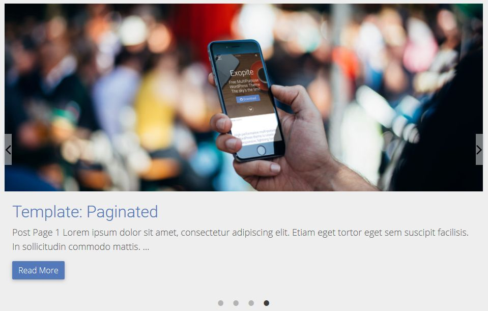
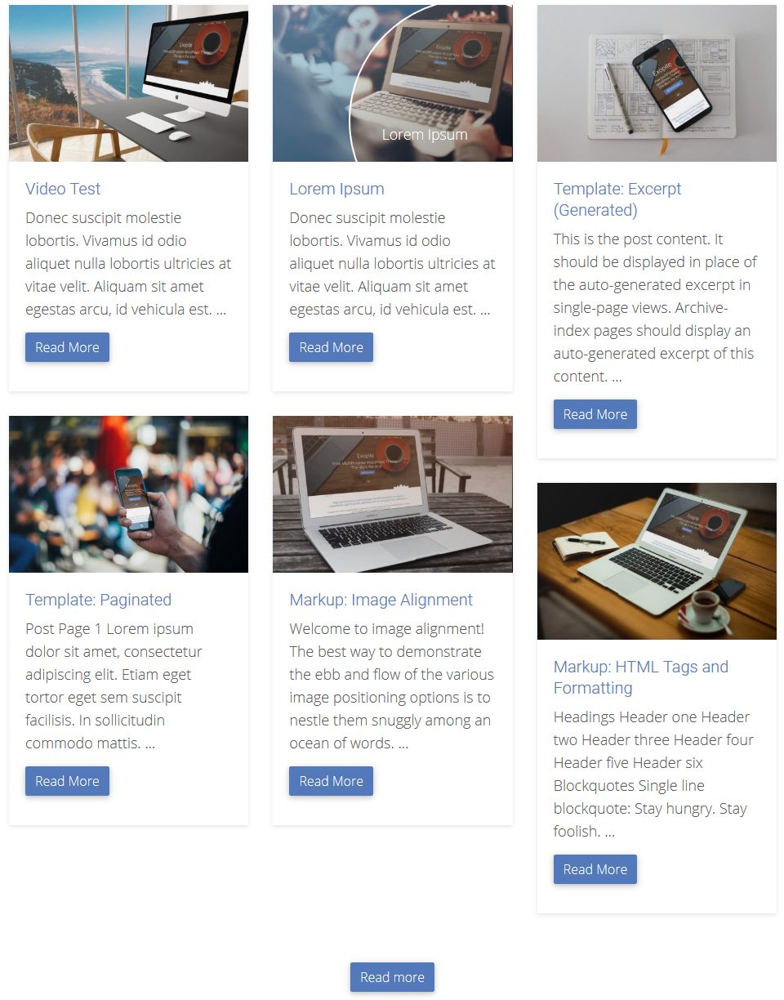
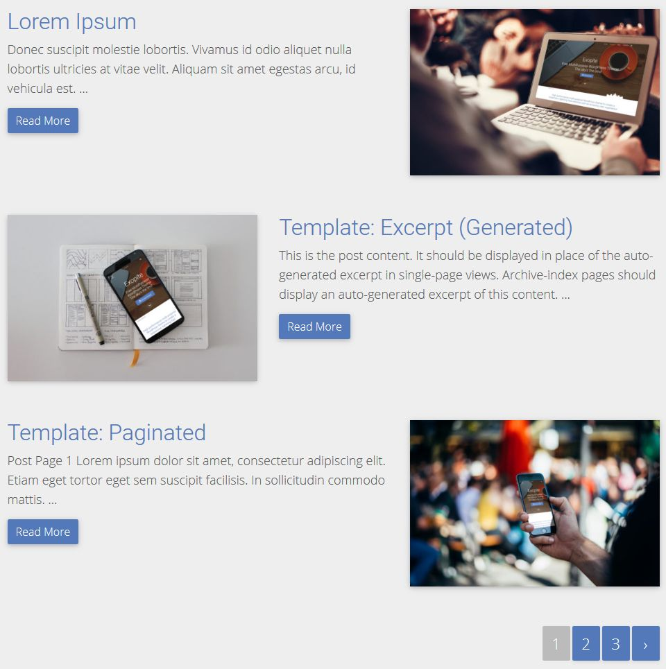
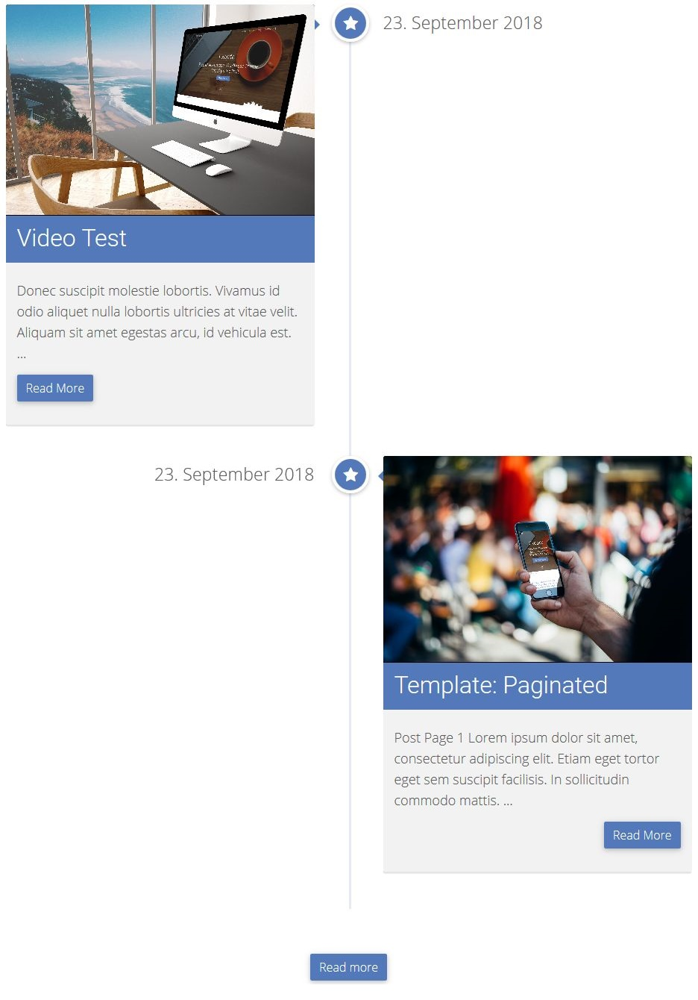
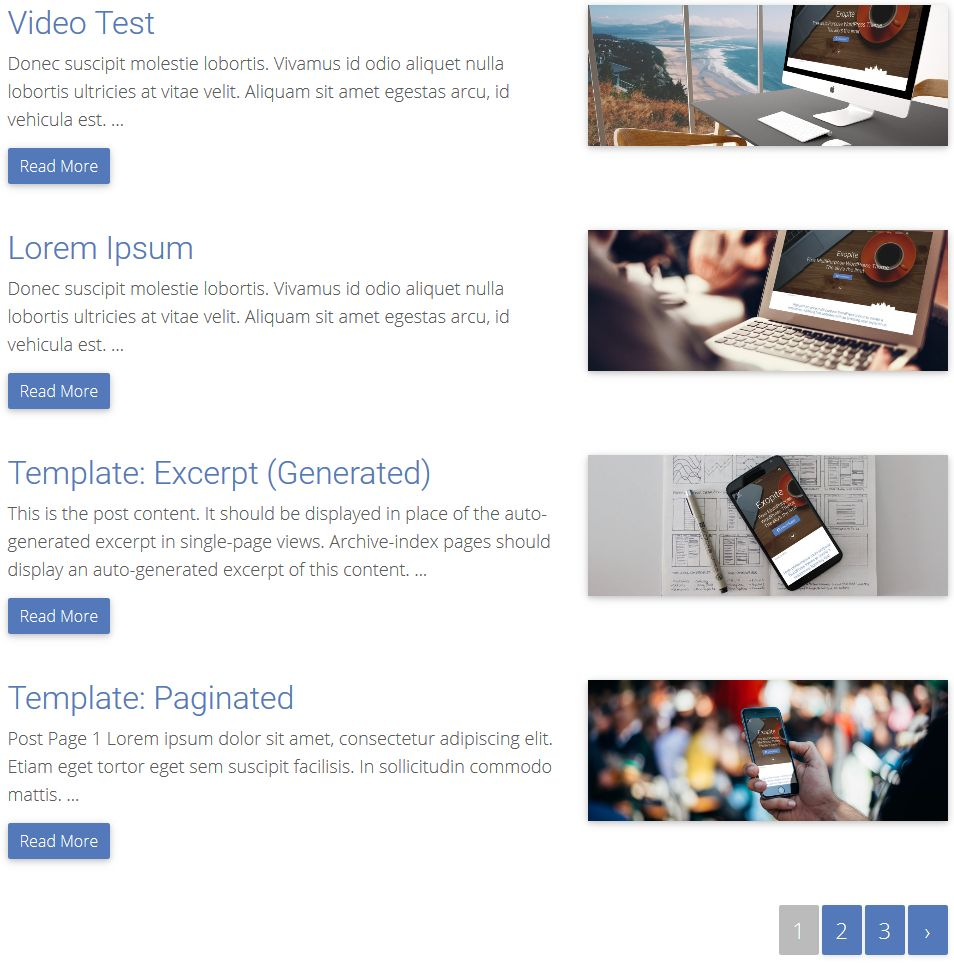
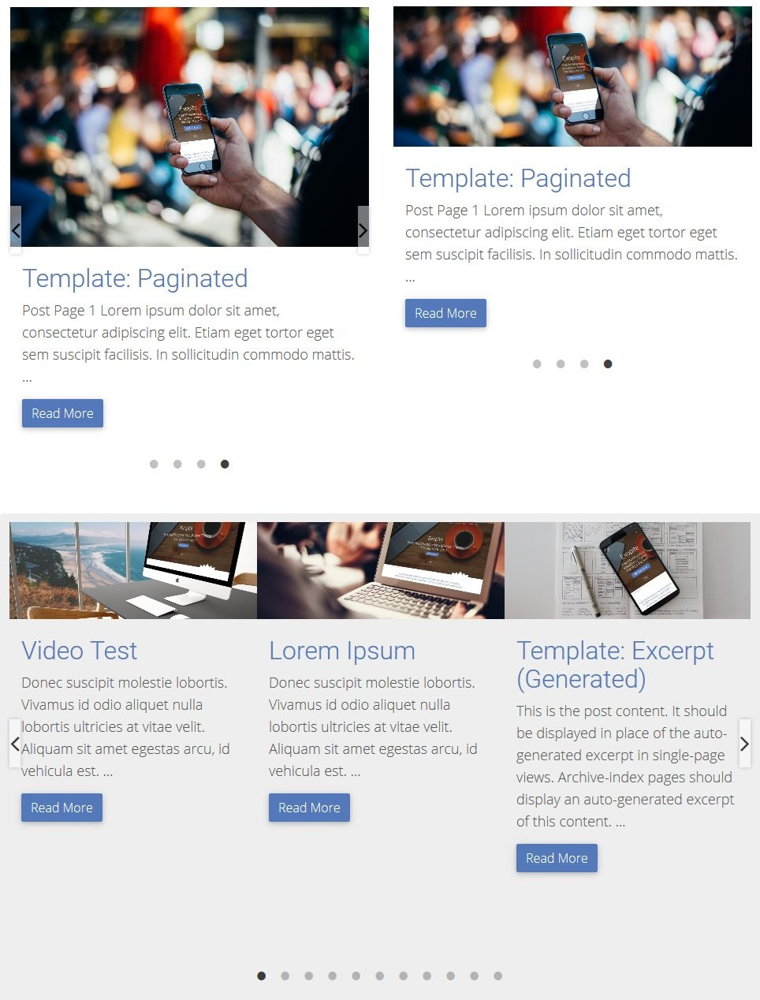

# Exopite Multifilter / Advanced filters
## WordPress Plugin

- Author: Joe Szalai
- Version: 20201020
- GitHub URL: https://github.com/JoeSz/exopite-multifilter/
- Plugin URL: https://www.joeszalai.org/exopite/multifilter/
- Demo URL: https://www.joeszalai.org/exopite/multifilter/exopite-multifilter-demos/
- Author URL: https://www.joeszalai.org
- License: GNU General Public License v3 or later
- License URI: http://www.gnu.org/licenses/gpl-3.0.html

IMPORTANT
-----------

From version 20190711
* taxonomies_terms changed to include_taxonomies, select posts in taxonomies, terms are not allowed 
filter will be displayed default.
* Update URL changed, need to update manually once!

DESCRIPTION
-----------

Exopite multifilter, mutlisortable, multi selectable, multi filterable sortable Wordpress Plugin

AJAX sorter/filter for any page or post types by multiple taxonomies or terms.  
(like post by categories/tags or any custom post type taxonomies like "portfolio-categories").  
Plugin working with a basic Bootstrap 4 Flex grid. Only enqueued, if style with 'bootstrap' or 'bootstrap-4' slug not already enqueued.

* Working with **any Themes** and any **post types**.
* Multiple styles as **normal**, **same height**, **masonry**, **timeline**, **gallery** or **carousel (slider)**.
* Single or **multiple filter** based on taxonomies and terms. **Multi selectable**.
* **Search** in pre-selected taxonomies and terms.
* Wordking via **shortcode**, can be used **multiple times** on a posts or pages (or any custom post types).
* AJAX **pagination**.
* AJAX **infinite loading**.
* AJAX **read more** loading.
* Update browser URL with infintie or read more loading based on page and scroll position.
* Store session (page number, selected filters and search).  
Useful if visitor is hit back or click on back button (if any) on the sinlge page/post.
* Bootstrap 4 Flex grid.
* JavaScript Hooks.  
https://github.com/carldanley/WP-JS-Hooks
* Translatable via po/mo files. Pot included.
* Multiple **hover effects**.  
https://tympanus.net/Development/HoverEffectIdeas/index.html  
https://tympanus.net/Development/HoverEffectIdeas/index2.html

#### Note
With Lazy load the masonry-desandro type not working completly nice.

### Live preview  

    

Mutlifilter with read more  |  Display without filer and gap |  Slider
:-------------------------:|:---------------------------:|:-------------------------:
      |        |  

Masonry  | Zig Zag | Equal height with title and excerpt
:-------------------------:|:---------------------------:|:-------------------------:
      |        |  

Timeline  | Regular Blog | Multi-slider
:-------------------------:|:---------------------------:|:-------------------------:
      |        |

USAGE
-----

The plugin working via `[exopite-multifilter]` shortcodes, does not display any admin options.  
You can use multiple shortcodes on the same page/post. On posts with 'pretty' permalink, pagination not working well.

Examples:
* To display posts with a selected categories, eg.:
`[exopite-multifilter thumbnail-size-single-row="your-big-size" thumbnail-size-multi-row="your-small-size" posts_per_page="6" posts_per_row="3" effect="goliath" pagination="readmore" taxonomy_terms__in="category(cat1-slug|cat1-slug)"]`
* Custom post type, eg.:
`[exopite-multifilter post_type="exopite-portfolio" thumbnail-size-single-row="blog-list-full" thumbnail-size-multi-row="blog-list-multiple" taxonomies_terms="exopite-portfolio-category, exopite-portfolio-tag"]`
* `[exopite-multifilter thumbnail-size-single-row="blog-list-full" thumbnail-size-multi-row="blog-list-multiple"]`

Available options

| Options                            | Values                                                                       | Defaults
| ---------------------------------- | ---------------------------------------------------------------------------- | --------
| `post_type`                        | ['post-type-slug'] as post type slug                                         | post
| `post_status`                      | ['post-status'] comma separated list                                         | publish
| `posts_per_page`                   | ['number'] how many post per page per shortcode                              | 4
| `posts_per_row`                    | ['1' - '4'] how many posts per row per shortcode                             | 2
| `display_title`                    | ['true' or 'false'] display post title                                       | false
| `display_pagination`               | ['true' or 'false'] display pagination                                       | true
| `display_filter`                   | ['true' or 'false'] display filter                                           | true
| `display_filter_title`             | ['true' or 'false'] display filter title                                     | true
| `blog_layout`                      | ['top', 'left', 'right', 'zigzag' or 'none']                                 | top
| `no-gap`                           | ['true' or 'false'] hide gap between post                                    | false
| `except_lenght`                    | ['number'] the lenght of the exceprt by words, '0' means no exceprt          | 0
| `except_more`                      | ['text'] excerpt more                                                        |
| `pagination`                       | ['pagination', 'readmore' or 'infinite'] the type of the pagination          | pagination
| `multi_selectable`                 | ['true' or 'false'] single or multiselect: true or false                     | true
| `thumbnail-size-single-row`        | ['thumbnail-size-slug'] thumbnail size for single post per row               | full
| `thumbnail-size-multi-row`         | ['thumbnail-size-slug'] thumbnail size for multipe post per row              | large
| `include_taxonomies`               | ['category, post_tag' or 'post_tag' etc...] display selected taxonomies       | category
| `taxonomy_terms__in`               | ['category(term1|terms2|...)] display selected terms in taxonomy            |
| `in_all_taxnomies`                 | ['true' or 'false'] If true, match all taxonomy queries (subtractive query), otherwise posts which match at least one taxonomy query (additive query) | true
| `update_paged`                     | ['true' or 'false'] Update page in browser URL bar on readmore and infinite loading based on viewport | false
| `display_page_number`              | ['true' or 'false'] Show page number between loads in infinite and readmore  | false
| `paged`                            | ['number'], Set start page number if not already paged                       | 1
| `effect`                           | ['apollo', 'duke', 'goliath', 'julia', 'lexi', 'ming', 'steve' or none]            | apollo
| `search`                           | ['search'] search in previously definied post type. If set, filter will be disabled. |
| `load_from_url`                           | ['true of false'] if set, plugin load filters, pagination or search from URL. Will override localstorage. Set `container_id` in shortcode is required to enable this option. Format need to be a JSON object, like: //www.exaple.net/?[...&]multifilter={"[container_id]":{"[taxonomy_terms__in]":{"[taxonomy1]":["term1[,...]"]},"paged":[page_number],"search":"[search_for]"}}, the [container_id] is required | false
| `store_session`                    | ['true' or 'false'] Store current session (page number, selected filters and search). Useful if visitor is hit back or click on back button | false
| `random`                           | ['true' or 'false'] randomize query (pagination, filters and search are off) | false
| `order`                            | ['asc' or 'desc'] Designates the ascending or descending order of the 'orderby' parameter. | desc
| `orderby`                          | ['string' or 'string1&#124;string2&#124;...'] Sort retrieved posts by parameter. WordPress default is 'date (post_date)'. |
| `display_metas`                    | ['author', 'date', 'taxonomy', 'last-modified' or 'commentcount'] display meta on post item |
| `display_metas_taxonomies`         | only if display_metas has 'taxonomy', taxonomy name to display (eg. for posts: category, post_tag), string or comma separated list |
| `container_id`                     | ['string'], Set wrapper/container id                                        |
| `container_classes`                | ['string or a comma searated list'], Set wrapper/container class[es]        |
| `style`                            | ['masonry', 'equal-height', carousel, timeline or empty] style      |
| `masonry_type`                     | ['waterfall-kudago', 'masonry-desandro'], type of masonry                   | waterfall-kudago
| `col_min_width`                    | ['number'] in px, only for waterfall-kudago                                 | 340
| `gallery_mode`                     | ['true', 'false'] Galley mode. On thumbnail click, open images insted of post type single. Post without a thumbnail will be ignored. | false
| `archive_mode`                     | ['true', 'false'] Automatically deal with archives. Only for posts. (Random, search, filters and taxonomies_terms will be disabled; posts_per_page is set to WordPress setting) | false
| `ajax_mode`                        | ['true', 'false'] Possibility to turn off AJAX loading. (Filters are off, no infinite or readmore pagination) | true
| `target_override`                  | ['true', 'false'] Override target location. Use <code>&lt;!-- exopite-multifilter-external-link: custom (absolute/relative) url --&gt;</code> or <code>&lt;!-- exopite-multifilter-internal-link: custom (absolute/relative) url --&gt;</code> from content instead of the 'the_perlamink', on 'gallery_mode' this won't change image url. Open exopite-multifilter-external-link in new tab and display taxonomies without links. | false
| `post_in`                          | ['post_id,post_id,...'] use post ids. Specify posts to retrieve.      |
| `post_not_in`                      | ['post_id,post_id,...'] use post ids. Specify post NOT to retrieve.      |
| `date_from`                        | ['2001-12-31'] iso date. Specify date to retrieve post AFTER.      |
| `date_to`                          | ['2002-12-31'] iso date. Specify date to retrieve post BEFORE.   |
| `video`                            | [meta_field_name] get video url from video field name. Set poster to post thumbnail. If empty video url, post thumbnail will be displayed.   |
| `video-args`                       | ['controls muted autoplay'] extra args to video tag. | controls muted
| `autoplay`                         | ['true', 'false'] carousel autoplay (only style="carousel"). | true
| `arrows`                           | ['true', 'false'] carousel display arrows (only style="carousel"). | true
| `autoplay_speed`                   | ['number'] carousel time to display each slide (only style="carousel"). | 300
| `infinite`                         | ['true', 'false'] carousel infinite (loop) play (only style="carousel"). | true
| `speed`                            | [1000] carousel slide changing speed (only style="carousel"). | 1000
| `pause_on_hover`                   | ['true', 'false'] carousel paise play on mouse hover (only style="carousel"). | true
| `dots`                             | ['true', 'false'] carousel display dots (only style="carousel"). | true
| `adaptive_height`                  | ['true', 'false'] carousel adaptive height (only style="carousel"). | false
| `mobile_first`                     | ['true', 'false'] carousel mobile first (only style="carousel"). | false
| `slides_per_row`                   | ['number'] carousel slides per row (only style="carousel"). | 1
| `slides_to_show`                   | ['number'] carousel slides to show (only style="carousel"). | 1
| `slides_to_scroll`                 | ['number'] carousel to scroll per turn (only style="carousel"). | 1
| `use_transform`                    | ['true', 'false'] carousel use css transition (only style="carousel"). | true
| `meta_key`                         | ['meta-key'] custom field key. |
| `meta_value`                       | ['meta-value'] custom field value. |
| `timeline-sub-date`                | [string/html] content under the timline date. |
| `timeline-date-format`             | ['date-string'] date format, <b> tag allowed, uses date_i18n. | 'j. F Y'
| `timeline-sticky`                  | ['true' or 'false'] make date sticky on scroll. | true

HOOKS (FILTERS)
---------------
* exopite-multifilter-thumbnail-image-url
* exopite-multifilter-thumbnail-oembed-url
* exopite-multifilter-thumbnail-link-url
* exopite-multifilter-thumbnail-video_url
* exopite-multifilter-thumbnail-link-target
* exopite-multifilter-filter-taxonomy-name
* exopite-multifilter-article-thumbnail
* exopite-multifilter-article-link
* exopite-multifilter-article-link-target
* exopite-multifilter-article-wrapper-begin
* exopite-multifilter-article-wrapper-end

INSTALLATION
------------

1. [x] Upload `exopite-multifilter` to the `/wp-content/plugins/exopite-multifilter/` directory

OR

1. [ ] ~~Install plugin from WordPress repository (not yet)~~

2. [x] Activate the plugin through the 'Plugins' menu in WordPress

REQUIREMENTS
------------

Server

* WordPress 4.0+ (May work with earlier versions too)
* PHP 5.3+ (Required)
* jQuery 1.9.1+

Browsers

* Modern Browsers
* Firefox, Chrome, Safari, Opera, IE 10+
* Tested on Firefox, Chrome, Edge, IE 11

PLANNED
-------

* On mobile 6 page number is too much -> how should be displayed?
* Add widget (useful for SiteOrigin Page Builder)
* Add to WordPress repo.

CHANGELOG
---------

= 20201020 - 2020-10-20 =
* Fixed: Uncaught ReferenceError: changeBrowserUrl is not defined
* Fixed: Uncaught ReferenceError: isElementInViewport is not defined

= 20190711 - 2019-07-11 =
* Added: Post status

= 20190129 - 2019-01-29 =
* Added: display filter title.
* Added hooks (filters):
    - exopite-multifilter-thumbnail-image-url
    - exopite-multifilter-thumbnail-oembed-url
    - exopite-multifilter-thumbnail-link-url
    - exopite-multifilter-thumbnail-video_url
    - exopite-multifilter-thumbnail-link-target
    - exopite-multifilter-filter-taxonomy-name
    - exopite-multifilter-article-thumbnail
    - exopite-multifilter-article-link
    - exopite-multifilter-article-link-target
    - exopite-multifilter-article-wrapper-begin
    - exopite-multifilter-article-wrapper-end

= 20180929 - 2018-09-29 =
* Added: oembed as thumbnail from post meta.
* Added: sticky date and subtitle for timeline.

= 20180923 - 2018-09-23 =
* Added: timeline style.

= 20180921 - 2018-09-21 =
* Added: taxonomy_terms__in, select posts only in selected terms in taxonomy
* Changed: IMPORTANT: taxonomies_terms to include_taxonomies, select posts in taxonomies, terms are not allowed

= 20180718 - 2018-07-18 =
* Fixed: PHP v7: string "true" || "false" is evaluated to TRUE everytime, thanks for Fires04 (GitHub)

= 20180712 - 2018-07-12 =
* Fixed: Plugin won't load (Fatal error), thanks for 0x4d0x44

= 20180509 - 2018-05-09 =
* Improvement: First display meta then title
* Fixed: Do not display meta list if empty

= 20180223 - 2018-02-23 =
* Added: order, orderby and meta_key
* Fixed: Slick carousel JavaScript type juggling

= 20180218 - 2018-02-18 =
* Fixed: some error for slider

= 20180216 - 2018-02-16 =
* Fixed: remove widget to avoid actiovation error

= 20180123 - 2018-01-23 =
* Added: meta_key and meta_value

= 20180121 - 2018-01-21 =
* Added: carousel mode
* Added: date query (from date and/or to date)

= 20180106 - 2018-01-06 =
* Added: post_in and post_not_in

= 20171204 - 2017-12-04 =
* Added: Target override. Override target location. Use <code>&lt;!-- exopite-multifilter-internal-link: custom (absolute/relative) url --&gt;</code>  from content instead of the 'the_perlamink'.
* Added: On <code>&lt;!-- exopite-multifilter-external-link: custom (absolute/relative) url --&gt;</code> open in new tab and taxonomies displayed without links.

= 20171101 - 2017-11-01 =
* Added: Target override. Override target location. Use <!-- exopite-multifilter-external-link: link or image -->  from content instead of the 'the_perlamink'.

= 20171015 - 2017-10-15 =
* Added: Archive mode. Automatically deal with archives.

= 20171009 - 2017-10-09 =
* Added: Galley mode. On thumbnail click, open images insted of post/page. It will not display post/pages/etc... without a thumbnail.

= 20171005 - 2017-10-05 =
* Improvement: equal-height for columns (flex)
* Improvement: enqueue scripts and styles only if shortcode present (enqueue both in footer)

= 20171004 - 2017-10-04 =
* Added: style options for equal-height.
* Improvement: load plugin scripts and styles only if shortcode present

= 20171003 - 2017-10-03 =
* Added: can load filter, pagination or search from URL.
* Added: container_id option to set wrapper/container id.
* Added: container_classes option to set wrapper/container class/es.

= 20170930 - 2017-09-30 =
* Fixed: some effects css didn't showed up property
* Improvement: "display_pagination" is moved to pagination: none

= 20170923 - 2017-09-23 =
* Added: placeholder image if thumbnail does not exist

= 1.0.4 - 2017-07-18 =
* Added: options to choose between additive and subtractive query.
* Added: options to randomize query.
* Added: options to display meta.
* Added: AJAX nonce.

= 1.0.3 - 2017-03-21 =
* Added: update function (for private hosting).  
This will be removed if plugin is submitted to WordPress repository.
https://github.com/YahnisElsts/wp-update-server

= 1.0.2 - 2017-03-05 =
* Improvement: Automatic script and style versioning for local css and js files based on file time.
https://www.doitwithwp.com/enqueue-scripts-styles-automatic-versioning/

= 1.0.1 - 2017-03-04 =
* Added: restore previous session (localstorage).
* Added: more filters.

= 1.0 =
* Initial release.

LICENSE DETAILS
---------------
The GPL license of Exopite Multifilter grants you the right to use, study, share (copy), modify and (re)distribute the software, as long as these license terms are retained.

DISCLAMER
---------

NO WARRANTY OF ANY KIND! USE THIS SOFTWARES AND INFORMATIONS AT YOUR OWN RISK!
[READ DISCLAMER.TXT!](https://joe.szalai.org/disclaimer/)
License: GNU General Public License v3

 
